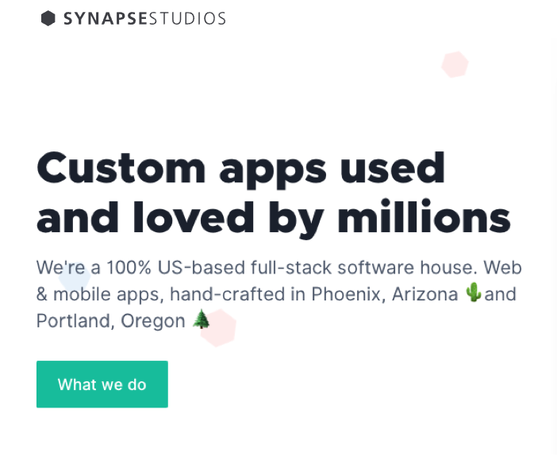
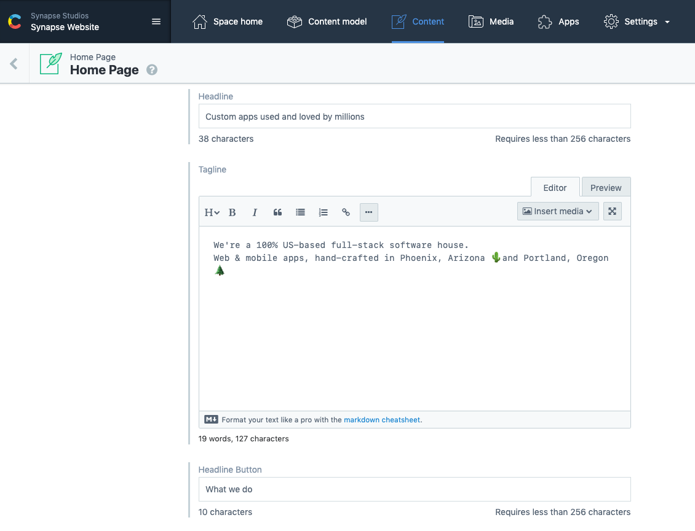
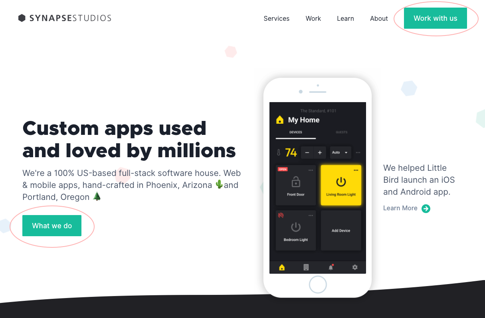
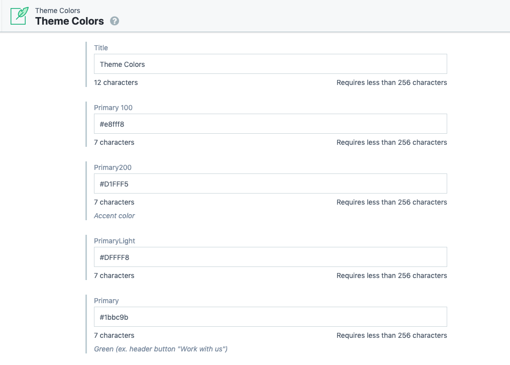

In this post I'll be going over an interesting problem I had to solve for while building out the redesign for Synapse Studios' marketing page. We needed a way to store the colors or the 'theme' for the site and use those colors anywhere, in any component so that they can be edited from one source of truth. If we decide to change the theme, those changes should reflect everywhere the colors are being used on the site.

<br />

## Gatsby

Taken from their site:

> Gatsby is a free and open source framework based on React that helps developers build blazing fast websites and apps

<p><a href="https://www.gatsbyjs.org/" target="_blank" rel="noopener noreferrer">Gatsby</a> allows you to build static sites while writing React. It also allows you to pull data from anywhere and then you use graphQL queries to access that data. The data for the Synapse site is coming from <a href="https://www.contentful.com/" target="_blank" rel="noopener noreferrer">contentful.</a></p>

<br />

## Contentful

Contentul is an "API-based cms" where:

> Editors collaborate on content interactively in an easy-to-use editing interface, while developers use the content with the programming language and templating frameworks of their choice.

<br />

## Using Gatsby w/ contentful

\*_This isn't a tutorial on how to link the 2 together, but here's a <a href="https://github.com/ryanwiemer/gatsby-starter-gcn" target="_blank" rel="noopener noreferrer">great starter package</a> that will get you up and running fast._

<br />

So how can do we use Gatsby with Contentful to create this hero for example:

<br />



Notice we have a headline, a tagline and button text, that's the data being displayed. The data is coming from contentful. In contentful, our corresponding data looks like this:

<br />



<br />

And this is how we access that data via graphQL queries:

```js
const IndexPage = ({ data }) => {
  const { headline, tagline, headlineButton } = data.home.edges[0].node
  return (
    <div>
      <h1>{headline}</h1>
      <div>{tagline}</div>
      <Button>{headlineButton}</Button>
    </div>
  )
}

export const indexPageQuery = graphql`
  query indexPageQuery {
    home: allContentfulHomePage {
      edges {
        node {
          id
          headline
          tagline
          headlineButton
        }
      }
    }
  }
`
```

In a pretty straightforward way, we grab the data we need, that data becomes available via the data prop and we simply display it in our JSX.

<br />

An important thing to note is how this query is tied to this specific component.
As in, if for some reason we needed to re-use this data in a separate component, we'd have to re-write this graphQL query.
That isn't so much of an issue in the case of this hero since it's only going to be display on the home page.
But what if we need to access data in many different places? Which brings us around to our theming issue.

<br />

Remember we want to use our theme colors anywhere in the site:

> We need a way to store the colors or the "theme" for the site in 1 single source of truth and then use those colors anywhere, in any component.

Not only do we want to use them here on the home page:



<br />

We also want to use them in things like callouts and headers and buttons throughout the site:

<br />


Keep in mind we totally could grab those colors in a query and then just re-write that query in every component we need them. But that's no way to live our lives.

<br />

So how can we write 1 single query to grab our colors and then access that data anywhere?

<br />

drum roll please...🥁🥁🥁

<br />

## useStaticQuery

```js
import { graphql, useStaticQuery } from 'gatsby'

useStaticQuery(graphql`
  query {
    allContentfulThemeColors {
      edges {
        node {
          primary
          secondary
          tertiary
        }
      }
    }
  }
`)
```

Our solution is one that comes baked in with Gatsby 🙌.
This <a href="https://www.gatsbyjs.org/blog/2019-02-20-introducing-use-static-query/">useStaticQuery</a> react hook,
one that Gatsby provides, takes a GraphQL query and returns your data. That’s it.

<br />

So running that useStaticQuery function would just return that query object:

```js

allContentfulThemeColors {
    edges {
        node {
            primary
            secondary
            tertiary
         }
    }
}

```

To access the contents of this query in a tidy way we can create a custom hook. We'll call it `useThemeColors`:

```js
import { graphql, useStaticQuery } from 'gatsby'

const useThemeColors = () => {
  const { allContentfulThemeColors } = useStaticQuery(graphql`
    query {
      allContentfulThemeColors {
        edges {
          node {
            primary
            secondary
            tertiary
          }
        }
      }
    }
  `)

  return allContentfulThemeColors.edges[0].node
}

export default useThemeColors
```

So here we have a custom hook useThemeColors which composes that useStatic query hook. We're de-structuring `allContentfulThemeColors` (which comes from the contentful API) from the query object.
We're sort of grabbing that value off of the query object and then we're just returning the data we need by drilling down further into the object. The result of this query is just going to be the contents of that node object, which are the theme colors themselves.

<br />

Now every time we need our colors, we can just use this custom hook:

```js
const IndexPage = ({ data }) => {
  const { headline, tagline, headlineButton } = data.home.edges[0].node
  // our useThemeColors Hook
  const colors = useThemeColors()

  return (
    <div>
      <h1>{headline}</h1>
      <div>{tagline}</div>
      <Button color={colors.primary}>{headlineButton}</Button>
    </div>
  )
}

export const indexPageQuery = graphql`
  query indexPageQuery {
    home: allContentfulHomePage {
      edges {
        node {
          id
          headline
          headlineButton
          tagline
        }
      }
    }
  }
`
```

<br />

Here we are assigning the constant `colors` to the return value of our useThemeColors hook then passing it to our button component's color prop.
So now that Button's color is reading from the value stored in contentful.

<br />

We can also use the colors in our callout component as the backgroundColor.
This time we're de-structuring the secondary color off of that node object and just passing it to the style prop of our surrounding `div`

```js
import React from 'react'
import useThemeColors from '../../hooks/useThemeColors'

const Callout = ({ heading, buttonText, description }) => {
  // our useThemeColors Hook
  const { secondary } = useThemeColors()

  return (
    <div
      style={{
        backgroundColor: secondary,
      }}
    >
      <h1>{heading}</h1>
      <div>{description}</div>
      <Button>{buttonText}</Button>
    </div>
  )
}

export default Callout
```

And there you have it, the problem we had of editing our theme colors from one source of truth is solved!

<br />

And if we look at contentful, we just have this theme colors content model where our colors are stored, this is our source of truth.

<br />



<br />

All of the colors we are using in the site are derived from this single source. If we change the primary color for instance from green to blue,
that will be reflected everywhere that primary color is being used on the site, which is many places.

<br />

Thanks for reading!
